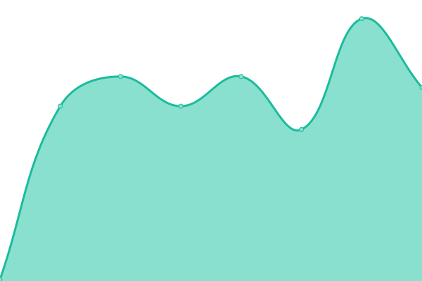
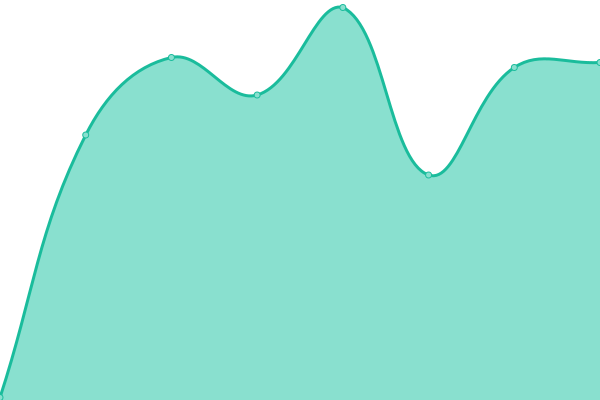

# Safe Gaming Cloud Status

This repository powers the status page for [Safe Gaming Cloud](https://safegamingcloud.com), built with [Upptime](https://upptime.js.org).

Live status: [status.safegamingcloud.com](https://status.safegamingcloud.com)

<!--start: status pages-->
<!-- This summary is generated by Upptime (https://github.com/upptime/upptime) -->
<!-- Do not edit this manually, your changes will be overwritten -->
<!-- prettier-ignore -->
| URL | Status | History | Response Time | Uptime |
| --- | ------ | ------- | ------------- | ------ |
|  [Website](https://safegamingcloud.com) | 🟥 Down | [website.yml](https://github.com/JGCdev/sgc-status/commits/HEAD/history/website.yml) | 

 0ms
     
 | 

<a href="https://status.safegamingcloud.com/history/website">100.00%</a>
    

|  [API](https://safegamingcloud.com/health) | 🟥 Down | [api.yml](https://github.com/JGCdev/sgc-status/commits/HEAD/history/api.yml) | 

 0ms
     
 | 

<a href="https://status.safegamingcloud.com/history/api">100.00%</a>
    

|  [API (Auth endpoint)](https://safegamingcloud.com/api/v1/auth/me) | 🟥 Down | [api-auth-endpoint.yml](https://github.com/JGCdev/sgc-status/commits/HEAD/history/api-auth-endpoint.yml) | 

 0ms
     
 | 

<a href="https://status.safegamingcloud.com/history/api-auth-endpoint">100.00%</a>
    

<!--end: status pages-->
